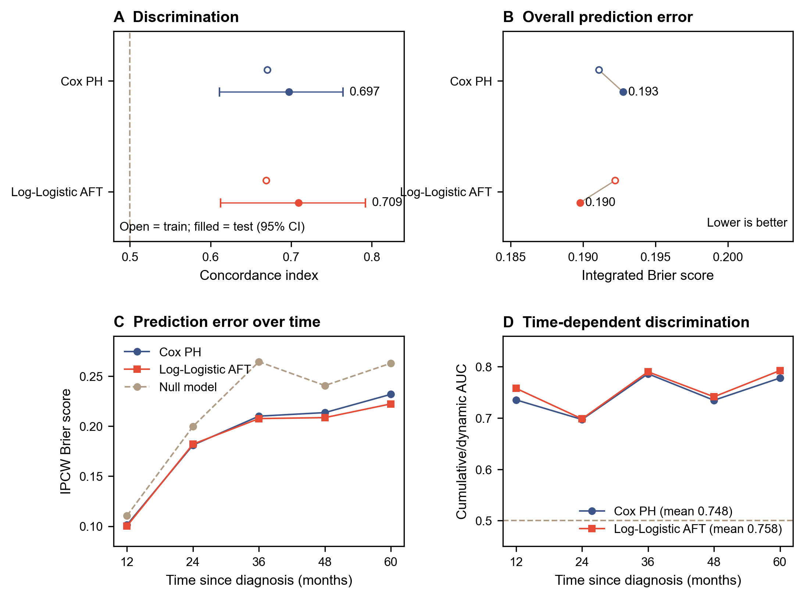
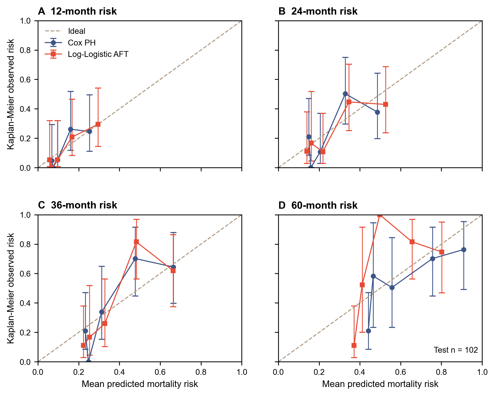
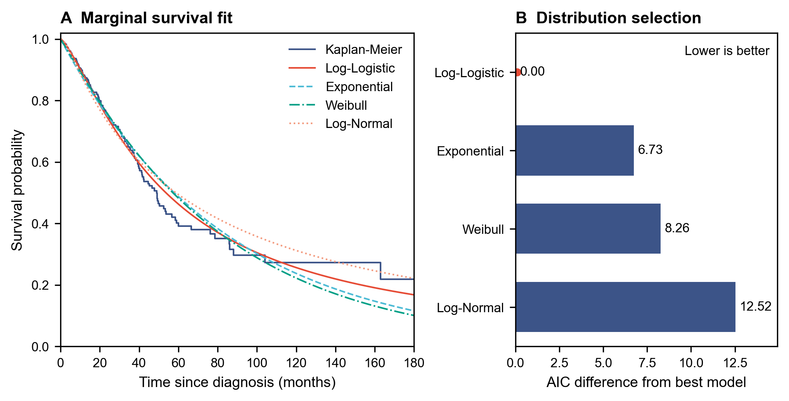

# TCGA-LUAD Overall Survival Command Center

An interactive [Shiny for Python](https://shiny.posit.co/py/) dashboard for transparent overall-survival prediction with Cox proportional hazards and parametric accelerated failure time models.

[Open the live application](https://medictio.shinyapps.io/nsclc-survival/)

> [!WARNING]
> This project is intended for research, education, and software demonstration only. It is not a medical device, has not been externally validated, and must not be used to guide treatment or estimate prognosis for an individual patient.

## Overview

The application uses publicly available clinical data from the [TCGA Lung Adenocarcinoma project](https://portal.gdc.cancer.gov/projects/TCGA-LUAD), obtained through the NCI Genomic Data Commons API. The checked-in model bundle contains 509 evaluable patients, with an overall-survival event rate of 36% and median observed follow-up of 21.6 months.

The dashboard provides:

- patient-specific Cox PH and Log-Logistic AFT survival curves;
- predicted survival probabilities at clinically interpretable time points;
- train/test C-index and Integrated Brier Score comparisons;
- test-set bootstrap confidence intervals for C-index;
- test-set Brier score and cumulative/dynamic AUC over time;
- marginal survival-distribution comparison by AIC;
- cohort stage summaries and a global visitor map; and
- a deployment-safe precomputed bundle without raw clinical feature tables.

## Model workflow

```text
TCGA-LUAD clinical survival data (n = 509)
                         |
        Base cleaning and outcome construction
          overall survival measured in months
                         |
             80/20 event-stratified split
                random seed = 42
                         |
     Training-set median imputation for five features
                         |
          +--------------+--------------+
          |                             |
   L2-regularised Cox PH          Parametric AFT
  5-fold CV penaliser grid      family selected by AIC
  selected penaliser = 0.001   Log-Logistic selected
          |                             |
          +--------------+--------------+
                         |
       Train apparent performance + held-out test
        C-index, IBS, dynamic AUC, and calibration
                         |
       Saved bundle -> Shiny survival dashboard
```

The fixed split contains 407 training patients and 102 held-out test patients. Imputation, Cox penaliser tuning, parametric-family selection, and model fitting use the training split only.

### Predictors

The current `tcga_luad_app_bundle.pkl` uses five clinical predictors:

1. age at diagnosis;
2. AJCC pathological stage;
3. pathological T stage;
4. pathological N stage; and
5. pathological M stage.

Missing predictor values are imputed with training-set medians. Users must preserve the coding and units expected by the application.

## Outcome and prediction semantics

The outcome is overall survival from diagnosis to death or last follow-up, converted from days to months. A recorded death is the event; patients alive at last follow-up are right-censored.

The application compares two model families:

- **Cox PH:** a semi-parametric proportional-hazards model with L2 regularisation and a Breslow baseline hazard estimator.
- **Log-Logistic AFT:** a parametric accelerated failure time model selected by the lowest training-set AIC among Weibull, Log-Normal, Log-Logistic, and Exponential candidates.

Displayed values such as `S(24 months)` are predicted probabilities of remaining alive beyond the specified time. They are population-model estimates rather than guarantees for an individual patient.

## Current bundle performance

The following values describe the checked-in bundle and its fixed 80/20 split. Training metrics are apparent performance; test metrics are held-out estimates. Mean AUC is reported for the test set only.

| Model | C-index train | C-index test | Test 95% bootstrap CI | IBS train | IBS test | Mean test AUC |
|---|---:|---:|---:|---:|---:|---:|
| Cox PH | 0.670 | 0.697 | 0.611-0.764 | 0.1911 | 0.1928 | 0.748 |
| Log-Logistic AFT | 0.669 | 0.709 | 0.613-0.792 | 0.1922 | 0.1898 | 0.758 |

Test C-index confidence intervals use 150 bootstrap resamples. Integrated Brier Score and cumulative/dynamic AUC are evaluated at 12, 24, 36, 48, and 60 months after restricting evaluation times to the observed support of both splits.

### Model evaluation figures

All figures below are rendered from `tcga_luad_app_bundle.pkl`. No raw clinical feature records are required to reproduce them.

#### Discrimination and prediction error

Panel A compares apparent training C-index with held-out test C-index and its bootstrap interval. Panel B compares train/test integrated Brier scores. Panel C shows the IPCW-corrected test Brier score over time, including a Kaplan-Meier null prediction. Panel D shows held-out cumulative/dynamic AUC.



#### Time-specific calibration

Predicted mortality risk is compared with Kaplan-Meier observed risk across five test-set risk groups at 12, 24, 36, and 60 months. These curves are descriptive: the test set contains 102 patients, and sparse late follow-up makes the 60-month estimates especially unstable.



#### Parametric distribution selection

Panel A compares the training-set Kaplan-Meier curve with four marginal parametric survival distributions. Panel B shows each candidate's AIC difference from the best fit. Log-Logistic had the lowest AIC (1579.1) and was therefore used for the covariate-adjusted AFT model.



## Run locally

Python 3.11 or newer is recommended.

```bash
git clone https://github.com/MUQING-create/lung-cancer-survival-app.git
cd lung-cancer-survival-app

python -m venv .venv
```

Activate the environment:

```powershell
# Windows PowerShell
.venv\Scripts\Activate.ps1
```

```bash
# macOS or Linux
source .venv/bin/activate
```

Install dependencies and start the app:

```bash
python -m pip install --upgrade pip
python -m pip install -r requirements.txt
shiny run --reload app.py
```

Open the local URL printed by Shiny, normally `http://127.0.0.1:8000`.

The app loads `tcga_luad_app_bundle.pkl` at startup. Keep the bundle beside `survival_app.py` when packaging or deploying the application.

## Deployment bundle

The tracked bundle contains fitted models, imputation statistics, outcome labels, survival probability matrices, evaluation metrics, marginal distribution fits, and aggregate cohort summaries. It does not contain raw training or test feature tables.

If the bundle is absent, the application can retrieve TCGA-LUAD clinical data from the GDC API, fit the models, and create the bundle. Model training is intentionally kept outside normal deployed startup by checking in the sanitized bundle.

## Deployment

The repository includes a shinyapps.io deployment helper:

```bash
python -m pip install rsconnect-python
python deploy.py
```

Configure `rsconnect` credentials before running the helper. It deploys the application as `medictio/nsclc-survival` and includes the precomputed model bundle.

For another hosting workflow, package at least:

- `app.py`
- `survival_app.py`
- `survival_core.py`
- `tcga_luad_app_bundle.pkl`
- `requirements.txt`
- `world.geojson` if the visitor map is enabled

Do not replace the deployment bundle with raw patient-level feature tables.

## Repository layout

```text
.
|-- app.py                         # Minimal Shiny entry point
|-- survival_app.py                # Data handling, UI, server, and figures
|-- survival_core.py               # Survival models and evaluation helpers
|-- tcga_luad_app_bundle.pkl       # Sanitized model and evaluation bundle
|-- assets/                        # Model evaluation figures for this README
|-- requirements.txt               # Runtime dependencies
|-- deploy.py                      # shinyapps.io deployment helper
|-- Dockerfile                     # Container definition
|-- upload.py                      # Hugging Face Space upload helper
`-- world.geojson                  # Basemap used by visitor analytics
```

## Limitations

- This is a retrospective analysis of one public cancer cohort and has no external, temporal, or prospective validation.
- The held-out test set contains only 102 patients, producing wide C-index intervals and unstable late-horizon calibration estimates.
- Only five routinely recorded clinical predictors are used; treatment, molecular, imaging, comorbidity, and performance-status information are not included.
- Proportional-hazards assumptions and parametric extrapolation assumptions require further validation before any clinical use.
- The single fixed split does not quantify the full variability of model development and selection.
- Missing values are median-imputed, which does not capture uncertainty from missing clinical information.
- Predictions reflect the TCGA-LUAD cohort and should not be generalized to other lung-cancer histologies or care settings without validation.

## Data attribution

The Cancer Genome Atlas Research Network. *Lung Adenocarcinoma (TCGA-LUAD)*. Clinical data are accessed through the [NCI Genomic Data Commons](https://portal.gdc.cancer.gov/projects/TCGA-LUAD).
